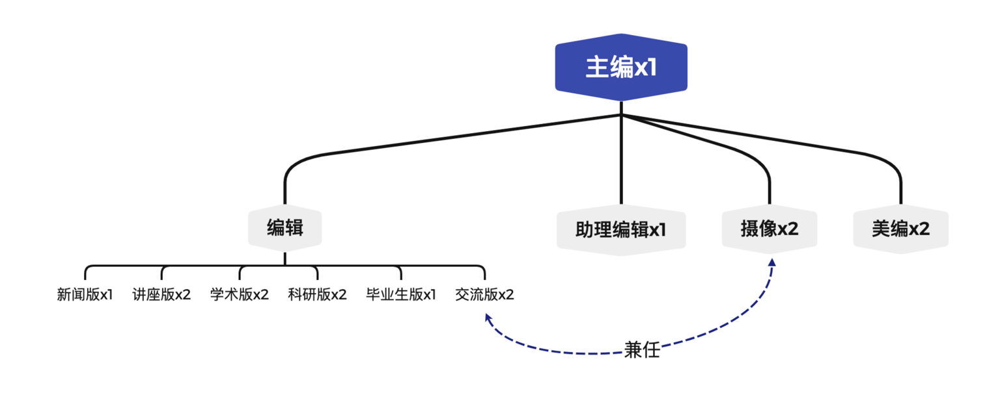

# 简介

LAMDA通讯是LAMDA实验室的内部季刊，在大家的任期内预期将参与四期通讯的出版工作，并在出版物的对应版面留下自己的名字。相信大家在这一年中会有很多的收获。

请各位同学仔细阅读**所有编辑必看**部分和自己对应版面的**具体工作要求**。编辑的名字会注明在各个文章或版面的对应位置，因此请大家仔细校对自己负责的内容。

同时也希望各位同学能够留心自己身边发生的事情，积极向主编建言献策。

* 编辑部架构

<figure><figcaption></figcaption></figure>

* 出版流程

<figure><figcaption></figcaption></figure>
